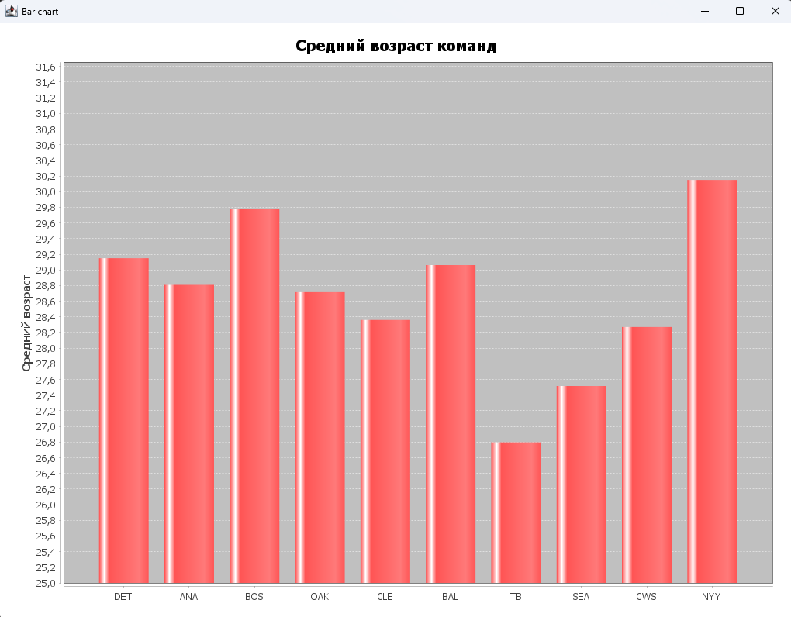
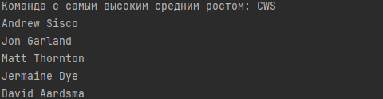
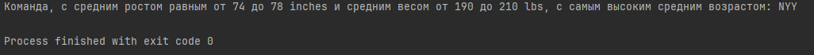

# Вариант 7. Показатели спортивных команд.

## Задание 1
***Задача:*** *Постройте график по среднему возрасту во всех командах.*

**График:**

## Задание 2
***Задача:*** *Найдите команду с самым высоким средним ростом. Выведите в консоль 5 самых высоких игроков команды.*

**Результат:**

## Задание 3
***Задача:*** *Найдите команду, с средним ростом равным от 74 до 78 inches и средним весом от 190 до 210 lbs, с самым высоким средним возрастом.*

**Результат:**

